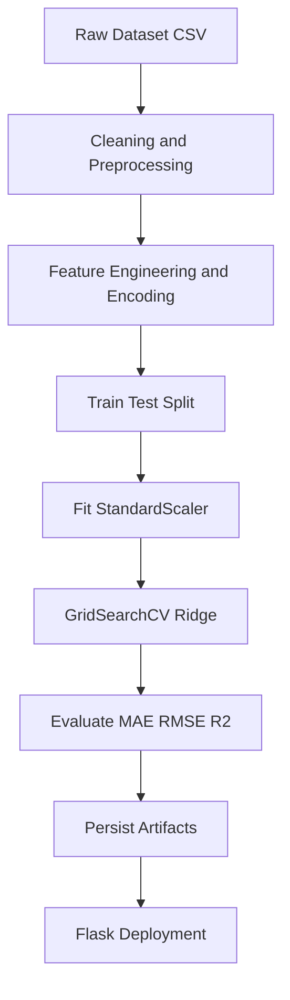
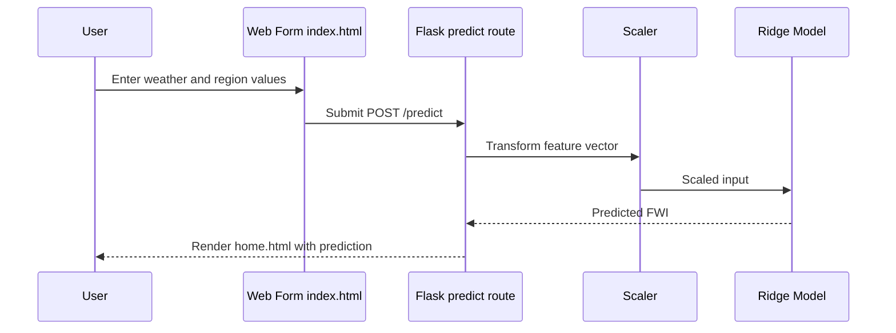

# System Architecture And Workflow

## System Architecture

```mermaid
flowchart LR
    A[User Browser] --> B[Flask App app.py]
    B --> C[Input Validation and Feature Mapping]
    C --> D[StandardScaler scaler.pkl]
    D --> E[Ridge Model ridge.pkl]
    E --> F[Predicted FWI]
    F --> G[Result Page home.html]
```

## Training Workflow

```mermaid
flowchart TD
    A[Raw Dataset CSV] --> B[Cleaning and Preprocessing]
    B --> C[Feature Engineering and Encoding]
    C --> D[Train Test Split]
    D --> E[Fit StandardScaler]
    E --> F[GridSearchCV Ridge]
    F --> G[Evaluate MAE RMSE R2]
    G --> H[Persist Artifacts]
    H --> I[Flask Deployment]
```

## Inference Workflow

```mermaid
sequenceDiagram
    participant U as User
    participant W as Web Form index.html
    participant F as Flask predict route
    participant S as Scaler
    participant M as Ridge Model

    U->>W: Enter weather and region values
    W->>F: Submit POST /predict
    F->>S: Transform feature vector
    S->>M: Scaled input
    M-->>F: Predicted FWI
    F-->>U: Render home.html with prediction
```
